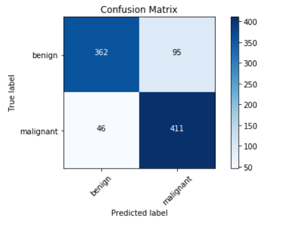
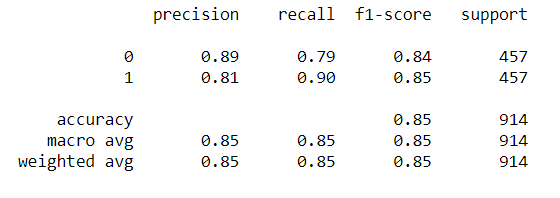

# Classification of Skin Lesion Images as Benign or Malignant

## Outline:
-----------------------------------------
    ├── models                     <- Saved models
    ├── README.md                  <- The project layout (this file)
    ├── images                     <- This is where the images are located
    │
    ├── notebook.ipynb             <- This is the main notebook (contains the python code)
    │
    ├── presentation.pptx          <- Non-technical presentation
    │
    ├── other_images               <- ppt and README images

## Introduction: 

The goal of this project was to utilize convolutional neural networks, or CNNs, for the purpose of classifying dermoscopic images as being benign or malignant. The malignancy includes squamous cell carcinoma, basal cell carcinoma, and melanoma, with the majority being melanoma. 

## Dataset:

The API for ISIC, or the International Skin Imaging Collaboration, was used to obtain the images that will be used to train, validate, and test the CNNs. The purpose of this public archive of clinical and dermoscopic images serves as a resource for teaching and the development of automated diagnostic systems. Their ultimate goal is to not only reduce the number of melanoma-related deaths through early detection, but to also reduce the number of unnecessary biopsies as well. The URL for this API can be found <a href='https://www.isic-archive.com/#!/topWithHeader/onlyHeaderTop/apiDocumentation'>here</a>.  

The ISIC archive contained a total of 2285 malignant images. Since that is the class we are most interested in, only 2285 benign images were obtained to keep the classes balanced, for a total of 4570 images. 

These images were split into a train, test, and validation set. First, the images were split at an 80/20 ratio to create the train and test sets. Then another 80/20 train/validation split was made to create the validation set. 

Set | Benign | Malignant |
--- | :---: | :---: | 
Train | 1462 |1462 |
Test | 457 | 457 |
Val | 366 | 365 | 

## Methodology:

Image preprocessing techniques largely depended on the model being used. All images were resized to 224 x 224 pixels for the models. Image augmentation techniques were also used to reduce over-fitting since our dataset is not exceptionally large. For transfer learning, special preprocessing techniques were also implemented depending on which pre-trained model was used. 

A basic convolutional neural network was used as the baseline model. In addition, the VGG16, VGG19, and Inception V3 pre-trained models were fine-tuned in an effort to increase accuracy scores. Different optimizers, learning rates, epoch numbers, and batch sizes were used in an effort to hypertune parameters.

Since the benign and malignant classes are balanced, validation accuracy was used as an evaluation metric for training the models. In addition, special attention was given to maximize recall/sensitivity scores since  false negatives are much more detrimental than false positives. 

## Results:

The model that provided the highest recall/sensitivity percentage was the VGG16 model. The last layer, the output layer, was removed and replaced with a dense layer that contains 2 nodes corresponding to the benign and malignant classes. Only this last layer was trained using the training images. All other layers used the original VGG16 pre-trained weights. Preprocessing included subtracting the mean RGB values in order to normalize the data. The adam optimizer was used, with a learning rate of 0.0001. Both the batch size and number of epochs was 10. 

#### Confusion Matrix: 

#### Other Scores:

As seen above, the model achieved a 90% recall score for the malignant class, along with a 79% recall score for the benign class. An overall accuracy score of 85% was attained. Other models had higher recall scores for the benign class, some as high as 86%, however, their recall scores for the malignant class was lower. 

## Conclusion:

A <a href='https://www.sciencedaily.com/releases/2018/05/180528190839.htm#:~:text=In%20level%20I%2C%20the%20dermatologists,CNN%20detected%2095%25%20of%20melanomas'>study</a> performed in 2018 asking 58 international dermatologists to classify 100 dermoscopic images as being benign or a melanoma (the most deadly of all skin cancers). The dermatologists detected 86.6% of melanomas on average, and 71.3% of benign moles. As seen in the results section, our best model achieved a 90% recall for the malignant class (compared to 86.6% in the study) and 79% for the benign class (compared to the 71.3% in the study). This is a promising result and can continue to improve with further hyperparameter tuning. 

## Recommendations:

I recommend that this model is used to assist primary-care physicians and dermatologists, who constitute the front line in melanoma detection, in diagnosing malignant skin cancers. Due to the high recall/sensitivity scores in the malignant class, the probability of a false negative test is quite low. However, the model should not be used as the deciding factor in making a diagnosis. 

## Future Work:

I believe that the model scores can continue to improve with further hyperparameter tuning and the availability of more images. However, larger computing power is required in order to utilize automated systems such as the keras tuner or gridsearch cross-validation to find and optimize hyperparameters. Once higher scores are achieved, the model can be then be deployed via a mobile app to facilitate access and use of this technology. 
